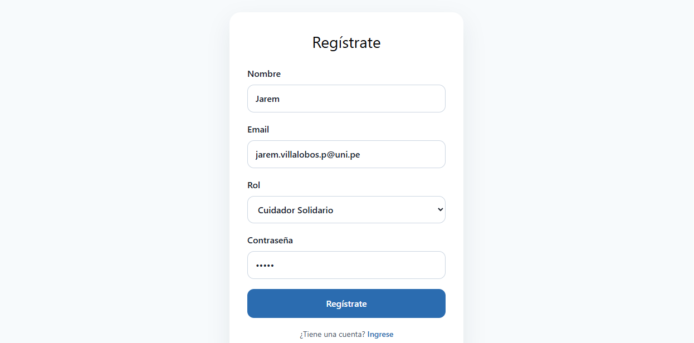
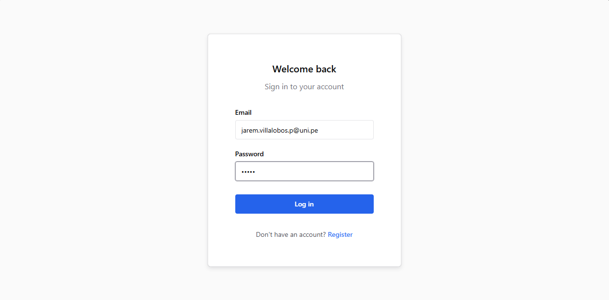
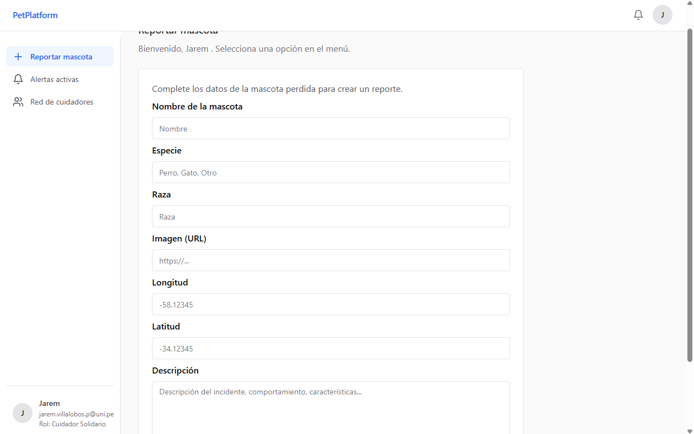
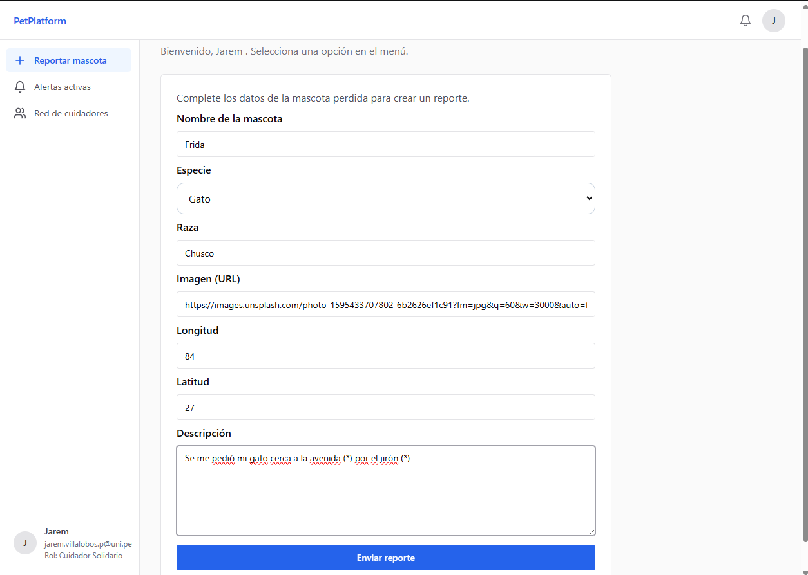
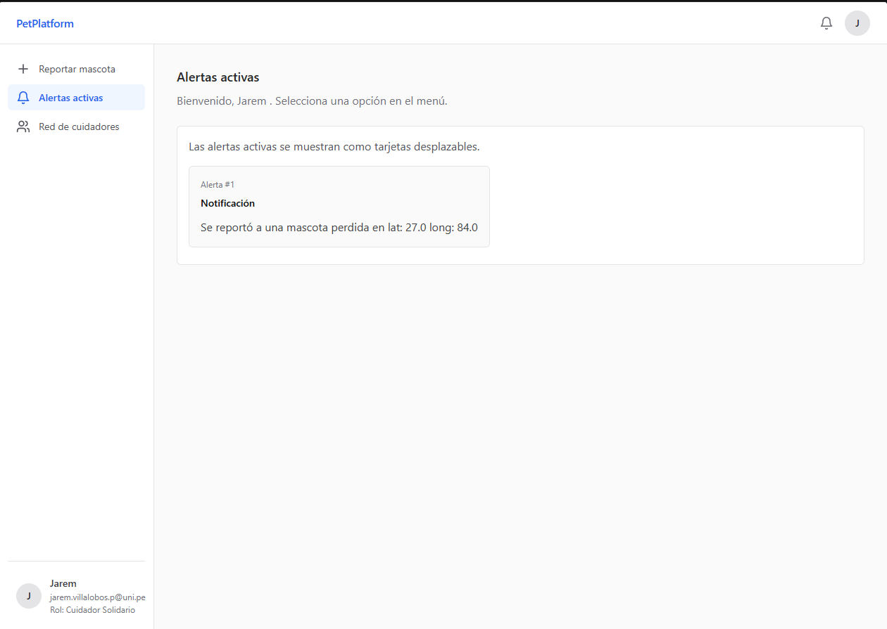

# Practica calificada N°4 - Informe
___
Nombres: Jarem Alexssander Villalobos Palomino
Código: 20234159K
___
## Requisitos satisfechos

1. Requerimientos: Reporte de Animales Perdidos y Alertas
Requerimientos Funcionales (RF)
RF 1.1: El sistema debe permitir a un dueño registrar una mascota como perdida ingresando nombre, especie, raza, foto y descripción.
RF 1.2: El sistema debe capturar las coordenadas geográficas del reporte (vía GPS del móvil o selección en mapa web).

3. Requerimientos: Red de Cuidadores de Mascotas
Requerimientos Funcionales (RF)
RF 3.1: El sistema debe permitir a los usuarios registrarse bajo tres roles: Cuidador Solidario, Profesional o Especializ

## Patrones de diseño aplicados:

### Strategy
Con el objetivo de desacoplar la autenticación del algoritmo empleado para ello, se ha utilizado un patrón Strategy:
`backend/src/users/domain/hash_strategy.py`
```python
class HashStrategy(ABC):

    @abstractmethod
    def hash(self, string : str )-> HashedPassword:
        pass

    @abstractmethod
    def compare_hash(self, string : str, hashed : HashedPassword) -> bool:
        pass
```
`backend/src/users/domain/token_handler.py`
```python
class TokenHandler(ABC):

    @abstractmethod
    def create_token(self, user : User) -> EncryptedToken:
        pass
    
    @abstractmethod
    def decode_token(self, token : EncryptedToken) -> Token:
        pass
```
De tal manera que ahora la autenticación está desacoplada de la librería de autenticación (Argon, Bcrypt, para este caso se usa Bcrypt), y la forma de
manejo del token, también. Sin embargo, el uso de un token como autenticación si es parte de las reglas de dominio asumidas

### Facade
Para coordinar la lógica de autenticación, una clase Facade es usada, puesto que involucra la coordinación de distintos componentes
a lo largo del módulo de usuarios
```python
class AuthFacade:

    token_handler : TokenHandler
    hash_provider : HashStrategy
    user_repo : UserRepository
    uow : UnitOfWork


    def __init__(
        self,
        token_handler : TokenHandler,
        hash_provider : HashStrategy,
        user_repo : UserRepository,
        uow : UnitOfWork
    ) -> None:
        self.token_handler = token_handler
        self.hash_provider = hash_provider
        self.user_repo = user_repo
        self.uow = uow

    async def login( self, email : str, password: str ) -> EncryptedToken:
        user: User | None = await self.user_repo.find_by_email(UserEmail(email))
        if user is None: raise UserNotFoundException

        if(not self.hash_provider.compare_hash(password,user.credentials.hashed_password)):
            raise UnauthorizedException

        return self.token_handler.create_token(user)

    async def register( self, name : str, email : str, password : str, role : UserRole ) -> None:
        
        hashed_password: HashedPassword = self.hash_provider.hash(password)
        try:
            async with self.uow:
                await self.user_repo.save_user(
                    User(
                        uid=UserId(0),
                        name=UserName(name),
                        credentials=UserCredentials(UserEmail(email),hashed_password),
                        role=role
                    )
                )
        except Exception as e:
            print(e.__str__())
            raise UnprocessableRegisterException("Unsuccessfull register")

        return
class UserNotFoundException(Exception) : pass
class UnprocessableRegisterException(Exception): pass
class UnauthorizedException(Exception) : pass
```

### Observer
Cuando un nuevo usuario sube una alerta, el sistema provoca en cascada una alerta a todos los usuarios del sistema (dada la imposibilidad de poder hacerlo por distancia). Esto naturalmente se mapea a un patrón Observer:

Sujeto:
```python
# Nota importante: Sólo hay un tipo de evento: El reporte de una mascota desaparecida
class AlertNewMissingPetSubject:

    suscribers : list[AlertHandler]

    def __init__(self) -> None:
        self.suscribers = []

    async def attach( self, handler : AlertHandler):
        self.suscribers.append(handler)

    async def dettach( self, handler : AlertHandler ):
        self.suscribers.remove(handler)

    async def notify(self, event : AlertNewMissingPetEvent):
        for handler in self.suscribers:
            await handler.handle( event )

```

Data transfer object y la interfaz del Handler u Observer
```python
@dataclass
class AlertNewMissingPetEvent:
    alert_id : AlertId
    coords : Coords


class AlertHandler(ABC):

    @abstractmethod
    async def handle(self, alert : AlertNewMissingPetEvent) -> None:
        #Maneja el evento de una nueva mascota reportada desaparecida
        pass
```

Implementación específica usada en la app
```python
class SQLNewMissinPetHandler(AlertHandler):

    session_factory : async_sessionmaker[AsyncSession]

    def __init__(
            self,
            session_factory : async_sessionmaker[AsyncSession]
        ) -> None:
        super().__init__()
        self.session_factory = session_factory


    async def handle(self, alert : AlertNewMissingPetEvent) -> None:
        async with self.session_factory() as session:
            uow = SQLUnitOfWork(session)
            user_repo = SQLUserRepository(session)
            async with uow:
                all_users = await user_repo.find_all()
                for user in all_users:
                    await user_repo.save_notification(
                        UserNotification(
                            user.uid,
                            alert.alert_id.uid,
                            text=f"Se reportó a una mascota perdida en lat: {alert.coords.lat} long: {alert.coords.long}"
                        )
                    )
```
Debido al comportamiento de FastAPI, estas clases deben de ser inyectadas de forma manual al inicio de la aplicación

```python
@asynccontextmanager
async def lifespan( app : FastAPI ):
    session_factory = async_sessionmaker(engine,expire_on_commit=False)
    subject = AlertNewMissingPetSubject()

    await subject.attach(
        SQLNewMissinPetHandler(
            session_factory
        )
    )
    
    app.state.alert_event_dispatcher = subject

    yield
    await engine.dispose()

app = FastAPI(lifespan=lifespan)
```
Es por este motivo, que la implementación específica del Observer espera un `async_sessionmaker` en lugar de usar otro patrón de arquitectura como el `UnitOfWork` que es usado por los demás componentes de la app. Así, maneja su propio ciclo de vida de la conexión a la base de datos.


## Pruebas de funcionalidad
### Registro


### Inicio de sesión


### Login exitoso
Notar que sale el rol en la sección izquierda inferior


### Enviando una alerta de desaparición


### Envío de notificaciones

El sistema envía notificaciones a todos los usuarios
